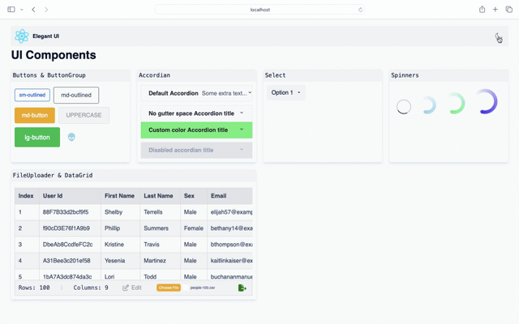

# Custom UI Components

 [](https://react-testing-cicd-qx9ikxpae-sachins-projects-73c22b5f.vercel.app)  
This project aimed to create reusable UI components using React and styled-components. It includes a variety of components such as buttons, accordions, select dropdowns, spinners, and more. The components are designed to be highly customizable and support dark mode.  

  

## Features

- Reusable UI components
- Built with React and styled-components
- Support for dark mode
- Easy to customize

## Testing

I use Jest and Enzyme for unit testing our components. Jest is a delightful JavaScript testing framework with a focus on simplicity, while Enzyme is a JavaScript Testing utility for React that makes it easier to assert, manipulate, and traverse React components' output.

To run the unit tests, simply execute the following command:

```
npm test
```

This command will trigger Jest to run all the tests defined in the `__tests__` directory or any files with a `.test.js` extension. Tests ensure that each component behaves as expected and meets the defined requirements.

## Continuous Integration and Deployment (CI/CD)

For continuous integration and deployment (CI/CD), we utilize GitHub Actions. GitHub Actions automatically triggers workflows defined in `.github/workflows` directory on every push or pull request to the repository. Our CI workflow runs unit tests to ensure code quality and reliability before merging changes into the main branch. Deployment workflows are configured to automatically deploy the project to our hosting platform (mention your hosting platform) after successful testing. This ensures that our project is always up-to-date and running the latest version in production. For more details, please refer to the workflows defined in the `.github/workflows` directory.

`GitHub Actions workflow` enables continuous integration and deployment (CI/CD) to Vercel for this vite react project. It automates the process of testing, linting, and deploying application to Vercel's hosting platform.

### Workflow Steps

1. **Setup Node.js Environment:** Sets up the required Node.js environment for the project.
2. **Checkout Code:** Retrieves the project code from the repository.
3. **Check for Merge Conflicts:** Checks for any merge conflicts in the codebase.
4. **Install Dependencies:** Installs project dependencies using npm.
5. **Run Tests:** Executes project tests.
6. **Lint Code:** Lints the project code for consistency and best practices.
7. **Deploy to Vercel:** Deploys the project to Vercel's hosting platform after successful tests and linting.

### Deployment to Vercel

- The deployment step pulls environment information from Vercel.
- It builds project artifacts and deploys them to the production environment on Vercel.

### Environment Variables

Ensure the following environment variables are set in your GitHub repository secrets:

- `VERCEL_ORG_ID`: Your Vercel organization ID.
- `VERCEL_PROJECT_ID`: Your Vercel project ID.
- `VERCEL_TOKEN`: Your Vercel authentication token.

### Usage

- Pushing to the `main` branch triggers the workflow to run.
- Pull requests to the `main` branch also trigger the workflow.

### Note

- This workflow assumes usage of Node.js 20 and integrates with Vercel CLI for deployment.

### Components props with descriptions

Here's the updated table with the added `Table` component, sorted alphabetically:

| Component       | Props           | Descriptions                                                                                   |
|-----------------|-----------------|------------------------------------------------------------------------------------------------|
| Accordian       | `title`<br>`subtitle`<br>`disableGutters`<br>`children` | Displays an accordion component with a title and optional subtitle.                     |
| AppGridContainer| -               | A container component that arranges its children in a grid layout.                             |
| Button          | `variant`<br>`size`<br>`color`<br>`uppercase` | Displays a button with customizable variants, sizes, and colors.                           |
| ButtonsGroup    | `children`      | Groups multiple buttons together.                                                              |
| Card            | `children`<br>`className` | A card component that displays content within a bordered container.                    |
| CardActions     | `children`      | Displays actions (e.g., buttons) at the bottom of the card.                                    |
| CardContent     | `children`<br>`className` | Displays content within the card body.                                                    |
| CardHeader      | `title`<br>`subheader`<br>`className` | Displays a header title for the card.                                                    |
| CardMedia       | `image`<br>`title`<br>`className` | Displays media content (e.g., images) within the card.                                  |
| DataGrid        | `columns`<br>`rows` | Component for displaying data in a grid format with customizable columns and rows.      |
| FileUpload      | `accept`<br>`maxFileSize`<br>`onChange`<br>`disabled` | Component for uploading files with accept type, maximum file size, and change handler. |
| GlobalStyles    | -               | Applies global styles to the application.                                                      |
| Navbar          | `logo`<br>`title`<br>`children` | Displays a navigation bar with a logo, title, and optional dark mode toggle.            |
| Select          | `options`<br>`width`<br>`onChange` | Displays a select dropdown component with customizable options.                    |
| Spinner         | `type`<br>`size`<br>`color` | Displays a spinner component with customizable size and color.                          |
| Table           | `headers`<br>`data` | Component for rendering a table with headers and data.                                     |
| Typography      | `variant`<br>`className` | Displays text with different variants.                                                   |
